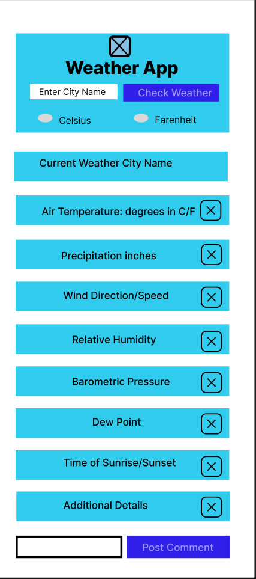
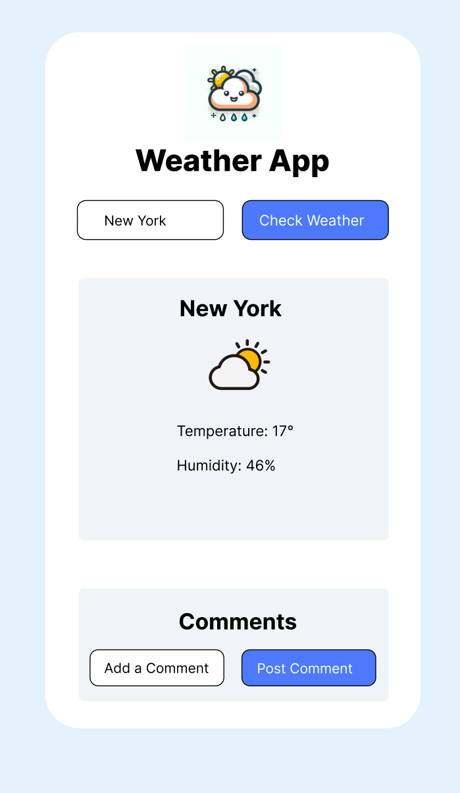

# WeatherApp

## Overview
The Weather App is an innovative web application that provides users with real-time weather data. Developed over a five-day sprint, our team, comprising David Butterton and Steven Espinoza, implemented Agile development techniques. We primarily focused on feature branching strategies, peer reviews, and merges to ensure code quality and collaborative integration of features.

## Development Team
- **David Butterton** ([@DavidButterton](https://github.com/DavidButterton))
- **Steven Espinoza** ([@RedBeret](https://github.com/RedBeret))

## Development Approach

- **Feature Branch Workflow:** Utilized a feature-branch Git workflow to isolate development of new features, ensuring stability in the main branch and facilitating peer reviews before merges.
- **Agile Methodology:** Employed an Agile approach to development, with adaptability and incremental progress as our guiding principles.
- **Kanban Board:** Managed tasks using a Kanban-style approach for visualizing the development process and ensuring efficient task completion.

## Features

- **Real-Time Weather Data:** Fetch and display current weather conditions, including temperature, humidity, wind, and weather icons, using a public weather API.
- **City Search Functionality:** Allows users to retrieve weather data for any city globally via an intuitive search interface.
- **Temperature Unit Toggle:** Provides the option to switch between Celsius and Fahrenheit units for user convenience.
- **Persistent Comments:** Enables users to post and view comments on weather conditions, with local storage preserving the commentary for each city.
- **Error Handling:** Delivers informative feedback for user actions, enhancing the usability of the application.

## User Experience

- **Enhanced User Interaction:** Enhanced User Interaction: In addition to a clickable submission button, our application supports form submission through the "Enter" keypress, enhancing user accessibility and convenience. This feature demonstrates our commitment to a friendly user experience, allowing for seamless interaction with the application's search and commenting functionality.
- **Interactive Commenting Feature:** Encourages user engagement by allowing feedback on weather conditions in various cities.

## Wireframes Visualization

<table>
  <tr>
    <th style="text-align: center;">LoFi Figma Wireframe (User Interface)</th>
    <th style="text-align: center;">HiFi Figma Drawing (User Interface)</th>
  </tr>
  <tr>
    <td style="text-align: center;">
      
      
This wireframe is for the user interface.

    </td>
    <td style="text-align: center;">
      
      
This shows the hifi Figma drawing of the weather app.

    </td>
  </tr>
</table>

## Final Application Screenshot
Below is a screenshot of the completed Weather App. It showcases the successful implementation of our design goals as well as some improvement. Showcasing the interactive and user-friendly interface that provides real-time weather updates and commenting feature.

## Atlassian Trello Kanban Board Visualization
The image below showcases our Atlassian Trello Kanban board, which was pivotal in visualizing our workflow and task management throughout the development process. It highlights how we organized our tasks, tracked progress through various stages of development, and collaborated as a team to ensure a smooth and efficient workflow.

## User Stories

  #### User Story 1: As a user, I want to check the weather for a specific city.

   - **Description:** Users should be able to enter the name of a city and view the current weather conditions, including temperature and weather    
    conditions, for that city.

   #### User Story 2: As a user, I want the option to toggle between Fahrenheit and Celsius temperature units.

   - **Description:** Users should have the flexibility to switch between Fahrenheit and Celsius temperature units to view weather data in their 
    preferred format.

   #### User Story 3: As a user, I want to leave comments about the weather for specific cities.

   - **Description:** Users should have the ability to provide comments about their experiences with the weather in different cities. These comments 
    should be stored and displayed for reference.

## Technical Implementation

- **Version Control:** Leveraged Git for version control, with a clear branching strategy for feature integration.
- **Peer Review:** Conducted thorough peer reviews to maintain code quality and foster knowledge sharing within the team.
- **Agile Practices:** Utilized Agile practices to prioritize tasks, track progress, and adapt to changes swiftly.

## Future Directions

- **Adaptability for Different Screen Sizes:** Plan to enhance the interface to be more adaptable to different screen sizes without a full responsive design implementation.
- **Multilanguage Support:** Considering implementing multi-language support to broaden the app's reach.
- **Weather Alerts:** Explore the integration of real-time weather alerts to provide additional value to users.

